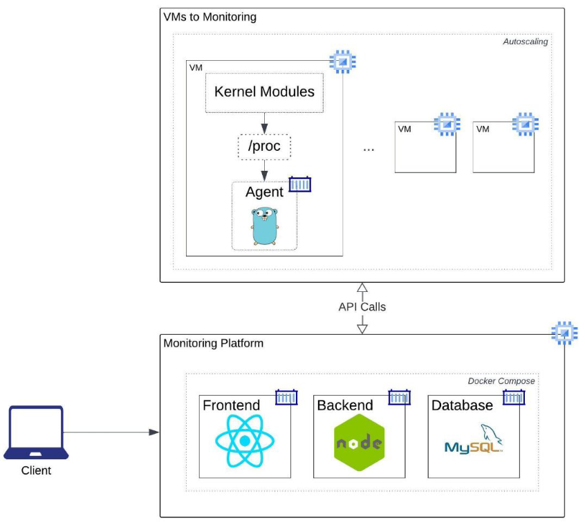
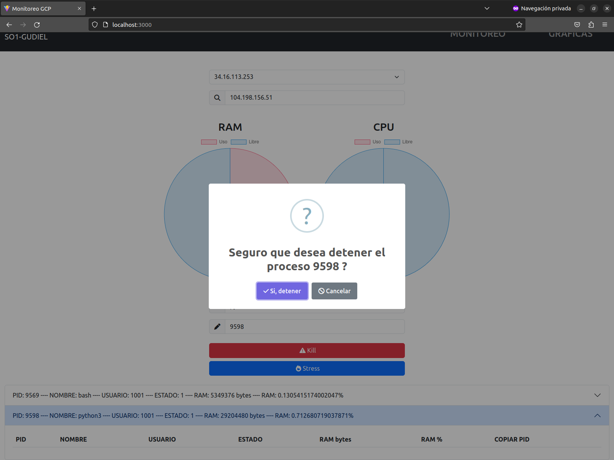
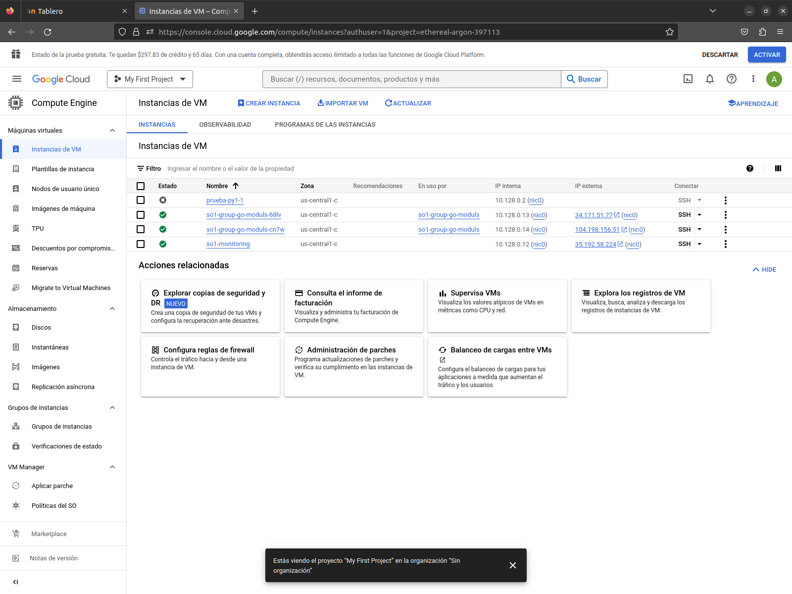

# PROYECTO 1

## Arquitectura



## Modulo CPU

* Forma en que se leen los procesos del CPU junto sus procesos hijos.
* En el codigo va comentando que es lo que se va obteniendo;

```c
static int escribir_archivo(struct seq_file *archivo, void *v) {

  total_time = 0;
  total_usage = 0;

  for_each_process(cpu) {
      seq_printf(archivo, "PID%d", cpu->pid); // Identificador del proceso: PID1
      seq_printf(archivo, ",");
      seq_printf(archivo, "%d", cpu->pid); // Identificador del proceso (solo numero): 1
      seq_printf(archivo, ",");
      seq_printf(archivo, "%s", cpu->comm); // Nombre del proceso
      seq_printf(archivo, ",");
      seq_printf(archivo, "%lu", cpu->__state); // Estado del proceso
      seq_printf(archivo, ",");

      if (cpu->mm) {
          rss = get_mm_rss(cpu->mm) << PAGE_SHIFT; // RAM en bytes que el proceso ocupa
          //rss = rss / megabyte;
          seq_printf(archivo, "%lu", rss);
      } else {
          seq_printf(archivo, "%s", "");
      }
      seq_printf(archivo, ",");

      seq_printf(archivo, "%d", cpu->cred->user->uid);
      seq_printf(archivo, ",");

      list_for_each(lstProcess, &(cpu->children)) {
          child = list_entry(lstProcess, struct task_struct, sibling);
          seq_printf(archivo, "CHILD%d", child->pid); // Identificador del proceso hijo: CHILD1
          seq_printf(archivo, ".");
          seq_printf(archivo, "%d", child->pid); // Identificador del proceso hijo (solo numero): 1
          seq_printf(archivo, ".");
          seq_printf(archivo, "%s", child->comm); // Nombre del proceso hijo
          seq_printf(archivo, ".");
          seq_printf(archivo, "%d", child->__state); // Estado del proceso hijo
          seq_printf(archivo, ".");

            if (child->mm) {
              rss = get_mm_rss(child->mm) << PAGE_SHIFT; // RAM en bytes que el proceso hijo ocupa
              seq_printf(archivo, "%lu", rss);
          } else {
              seq_printf(archivo, "%s", "");
          }
          seq_printf(archivo, ".");

          seq_printf(archivo, "%d", child->cred->user->uid);
          seq_printf(archivo, ".");
      }

      seq_printf(archivo, ";"); // Fin de cada proceso

      // ****
      total_time += cpu->utime + cpu->stime;

      if(prev_total_time != 0){
          total_usage = total_time - prev_total_time;
          aux = total_usage * 100;
          aux2 = jiffies_to_msecs(1) * HZ;
          total_usage = aux / aux2;
          seq_printf(archivo, "%llu", total_usage);
      }

      prev_total_time = total_time;
      // ****

      return 0;
  }

}
```

## Modulo RAM

* Forma en que se obtienen los datos de la memoria RAM.

```c
static int escribir_archivo(struct seq_file *archivo, void *v) {
    
    init_meminfo();

    unsigned long total_ram = si.totalram * (unsigned long long)si.mem_unit / megabyte;
    unsigned long ram_usada = (si.totalram - si.freeram) * (unsigned long long)si.mem_unit / megabyte;
    unsigned long ram_libre = si.freeram * (unsigned long long)si.mem_unit / megabyte;
    unsigned long porc_uso = ram_usada * 100;
    unsigned long porcentaje_uso = porc_uso / total_ram;

    seq_printf(archivo, "%lu", total_ram);
    seq_printf(archivo, ",");
    seq_printf(archivo, "%lu", ram_usada);
    seq_printf(archivo, ",");
    seq_printf(archivo, "%lu", ram_libre);
    seq_printf(archivo, ",");
    seq_printf(archivo, "%lu", porcentaje_uso);

    return 0;
}
```

## Backend Go

* Lectura de modulos:

```golang
cmd := exec.Command("sh", "-c", "cat /proc/ram_201404278")
	output, err := cmd.CombinedOutput()
```

* Kill de procesos:

```golang
cmd := exec.Command("sh", "-c", "kill -9 "+newData.Pid)
	output, errr := cmd.CombinedOutput()
```

* Estresar CPU:

```golang
cmd := exec.Command("sh", "-c", "stress --cpu 2 --timeout 60s")
	output, errr := cmd.CombinedOutput()
```

* Servidor y Endpoints:

```golang
app := fiber.New()

app.Use(cors.New())

userGroup := app.Group("/api/go")
userGroup.Get("/moduls", modulsController)
userGroup.Post("/process", killProcessController)
userGroup.Get("/stress", stressController)
userGroup.Get("/", helloWorld)

err := app.Listen(":5000")

if err != nil {
  log.Fatal("Error", err)
}

fmt.Println("Server running on port 5000...")
```

## Backend NodeJS

* Variables de entorno, el archivo tiene que estar en la raiz del proyecto:

```
USER_DB=root
PASSWORD_DB=secret
DATABASE_DB=db_monitoreo
HOST_DB=database
```

* Endpoints para estresar CPU, recibe la peticion desde el frontend y redirecciona hacia el backend de GO.

```js
const axios = require('axios');
const { response } = require('../helpers/response.helper');

const stress_pc = async (req, res) => {
    try {

        const { url_golang } = req.body;
        
        const responseAxios = await axios.get(url_golang);

        response(res, 200, 'Stress realizado con exito.', responseAxios.data);

    } catch (error) {
        return response(res, 400, 'Error al realizar stress.', [error]);
    }
};

module.exports = { stress_pc };
```

* Lo mismo es para leer modulos y hacer un kill de los procesos.
* Modelos para guardar en la base de datos:
  * Se guarda el uso de CPU y RAM junto con su fecha.

```js
const { execute, execute2 } = require('../helpers/execute.helper');

const insertPerformance = (params, callback) => {

    const newData = [
        params.uso_cpu,
        params.uso_ram
    ];

    const query = `INSERT INTO Rendimiento(uso_cpu,uso_ram,fecha) VALUES(?,?,now());`;

    return execute(query, newData, callback);
};

const readPerformance = (callback) => {
    
    const query = `SELECT id, uso_cpu, uso_ram, DATE_FORMAT(fecha, "%Y-%m-%d") fecha FROM Rendimiento 
                    ORDER BY id DESC 
                    LIMIT 20;`;

    return execute2(query, callback);
};

module.exports = { insertPerformance, readPerformance };
```

## Base de datos

* Es ejecuta y se levanta desde el docker-compose.
* Script utilizado:

```sql
DROP DATABASE IF EXISTS db_monitoreo;
CREATE DATABASE db_monitoreo;

USE db_monitoreo;

CREATE TABLE Rendimiento (
    id INT NOT NULL AUTO_INCREMENT,
    uso_cpu INT NOT NULL,
    uso_ram INT NOT NULL,
    fecha date NOT NULL,
    PRIMARY KEY (id)
);
```

## Frontend - React

* Variables de entorno:
  * Para manejar las IP se usaron variables de entorno, que el archivo .env tiene que estar en la raiz del proyecto:

```
VITE_IP_GO1="34.16.113.253"
VITE_IP_GO2="34.42.177.26"
VITE_IP_NODE="35.192.58.224"
```

* Servicios para hacer peticiones:
  * Recibe IP de GO y de NODE, asi como PID del proceso cuando sea el caso. 

```js
import axios from 'axios';

export const getDataMonitoring = async (data) =>
    await axios.post("http://" + data.ipNode + ":5001/api/node/moduls", { "url_golang": "http://" + data.ipGoAcutal + ":5000/api/go/moduls" });

export const killPidService = async (data) => 
    await axios.post("http://" + data.ipNode + ":5001/api/node/process", { "url_golang": "http://" + data.ipGoAcutal + ":5000/api/go/process", pid_pross: data.pid_pross });

export const stressCpuService = async (data) =>
    await axios.post("http://" + data.ipNode + ":5001/api/node/stress", { "url_golang": "http://" + data.ipGoAcutal + ":5000/api/go/stress" });
```

* Vista Monitoring:
  * Cuando inicia se empiezan hacer las peticiones hacia el backend, para obtener los datos de los modulos.

```js
useEffect( () => {
    getDataModuls();
    const myInterval = setInterval( async () => {

        getDataModuls();

    }, 8000);

    return () => clearInterval(myInterval);
    
}, [ipGoAcutal,textSearch,ipGoScaling]);
```

* Peticion para obtener datos de modulos y asignar valores:

```js
let ip_actual = ipGoScaling == '' ? ipGoAcutal : ipGoScaling;
console.log(ip_actual); 
const res = await getDataMonitoring({ "ipGoAcutal": ip_actual, "ipNode": import.meta.env.VITE_IP_NODE});
let porc_cpu  = parseInt(res.data.data.Porcentaje_uso_cpu);
let porc_ram = parseInt(res.data.data.Ram_data.Porcentaje_uso);
setDataGraphicRam([porc_ram, 100-porc_ram]);
setDataGraphicCpu([porc_cpu,100-porc_cpu]);
setDataTotalRam(res.data.data.Ram_data.Total);
```

* Busqueda de procesos:

```js
const searchProcess = (searchTerm) => {
    return dataProcessComplet.filter((pross) => {
        // si nombre proceso coincide
        if (pross.Nombre.toLowerCase().includes(searchTerm.toLowerCase())) {
            return true;
        }

        // si algun proceso hijo coincide
        if(pross.Hijos != null) {
            if(
                pross.Hijos.some((proshijo) => proshijo.Nombre.toLowerCase().includes(searchTerm.toLowerCase()))
            ) {
                return true;
            }
        }
        
        // no hay coincidencia
        return false;
    });
}
```

* Kill de un proceso:

```js
let ip_actual = ipGoScaling == '' ? ipGoAcutal : ipGoScaling;
const res = await killPidService({ "ipNode": import.meta.env.VITE_IP_NODE, "ipGoAcutal": ip_actual, "pid_pross": textPidKill});
```

* Stress de CPU:

```js
let ip_actual = ipGoScaling == '' ? ipGoAcutal : ipGoScaling;
const res = await stressCpuService({ "ipNode": import.meta.env.VITE_IP_NODE, "ipGoAcutal": ip_actual });
```

* Componente grafica de pastel:
  * Recibe como parametros los datos a mostrar cuando se leen los modulos cada cierto tiempo.
* Lo mismo pasa para las graficas de uso de rendimiento de CPU y RAM.

```js
import React from 'react';
import { Chart as ChartJS, ArcElement, Tooltip, Legend } from 'chart.js';
import { Pie } from 'react-chartjs-2';
ChartJS.register(ArcElement, Tooltip, Legend);

export const GraphicPie = (params) => {

    let data = {
        labels: ['Uso', 'Libre'],
        datasets: [
            {
            label: 'Porcentaje',
            data: params.datagraph,
            backgroundColor: [
                'rgba(255, 99, 132, 0.2)',
                'rgba(54, 162, 235, 0.2)',
            ],
            borderColor: [
                'rgba(255, 99, 132, 1)',
                'rgba(54, 162, 235, 1)',
            ],
            borderWidth: 1,
            },
        ],
    };
      

  return (
    <>
        <h3 className="d-flex justify-content-center">{params.nameGraph}</h3>
        <Pie data={data}></Pie>
    </>
  )
}
```


## VM Modulos - Go

* Instalar compilador GCC.
* Instalar Docker.
* Instalar stress.
* Instalar Modulo CPU Y RAM.

### Instalacion de compilador GCC:

* GCC

```bash
sudo apt update
sudo apt install build-essential
```

### Instalacion de Docker:

* Docker

```bash
# Add Docker's official GPG key:
sudo apt-get update

sudo apt-get install ca-certificates curl gnupg

sudo install -m 0755 -d /etc/apt/keyrings

curl -fsSL https://download.docker.com/linux/ubuntu/gpg | sudo gpg --dearmor -o /etc/apt/keyrings/docker.gpg

sudo chmod a+r /etc/apt/keyrings/docker.gpg

# Add the repository to Apt sources:
echo \
  "deb [arch="$(dpkg --print-architecture)" signed-by=/etc/apt/keyrings/docker.gpg] https://download.docker.com/linux/ubuntu \
  "$(. /etc/os-release && echo "$VERSION_CODENAME")" stable" | \
  sudo tee /etc/apt/sources.list.d/docker.list > /dev/null
sudo apt-get update

# To install the latest version, run:
sudo apt-get install docker-ce docker-ce-cli containerd.io docker-buildx-plugin docker-compose-plugin

# Verify that the Docker Engine installation is successful by running the hello-world image:
sudo docker run hello-world

# To create the docker group and add your user
sudo groupadd docker

sudo usermod -aG docker $USER

newgrp docker
```

### Instalar modulo CPU:

* Clonar repositorio.
* Dirigirnos a la carpeta "modulo_cpu", donde esta el archivo cpu.c
* Generar archivos:
    * make all
* Limpiar consola:
    * sudo dmesg -C
* Instalar o pasar el modulo al kernel:
    * sudo insmod cpu.ko
* Ver o leer mensajes:
    * sudo dmesg
* Eliminar el modulo:
    * sudo rmmod cpu.ko
* Nos dirigimos a /proc para listar archivos y ver contenido del modulo:
    * cat cpu_201404278

### Instalar modulo RAM:

* Clonar repositorio.
* Dirigirnos a la carpeta "modulo_ram", donde esta el archivo ram.c
* Generar archivos:
    * make all
* Limpiar consola:
    * sudo dmesg -C
* Instalar o pasar el modulo al kernel:
    * sudo insmod ram.ko
* Ver o leer mensajes:
    * sudo dmesg
* Eliminar el modulo:
    * sudo rmmod ram.ko
* Nos dirigimos a /proc para listar archivos y ver contenido del modulo:
    * cat ram_201404278

### Levantar contenedor a manita:

* Docker build y Docker run:

```bash
sudo docker build -t so1gomuduls .
sudo docker run -it -p 5000:5000 --privileged --pid=host -d so1gomuduls
```

* Instalar Stress dentro del contenedor (se modifico el Docker file, ya no es necesario este paso):

```bash
docker exec -it id_contenedor /bin/sh
apt-get update
apt-get install -y stress
```

### Levantar contenedor con docker compose:

* Levantar y detener contenedores:

```bash
docker compose up -d
docker compose down
```

### Instalar Python para prueba de kill

* Comandos:

```bash
sudo apt update
sudo apt install python3-pip
pip3 install Flask
mkdir pruebap
cd pruebap
nano app.py (poner el codigo)
python3 app.py & (compilar app)
```

* Codigo:

```python
from flask import Flask

app = Flask(__name__)

@app.route('/')
def saludo():
    return "Hola Mundo - 201404278"

if __name__ == '__main__':
    app.run(host='0.0.0.0', port=3000)
```

## Docker Hub

* Crear repositorio.
  * Nombre ejemplo: so1-back-go-moduls
* Creamos Access Token:
  * Gudiel -> Account settings.
    * Security.
    * New Access token.
    * Descripción o nombre y permisos.
    * Nos va dar una como clave.
    * Nos da los pasos para el login.
* En la consola de nuestra PC:
  * docker login -u user_name.
  * password: Token que nos dio docker hub.
  * Tiene que salir login succeeded.
* Construimos imagenes:
  * docker compose build
* Ver las imagenes por porcion de nombre en comun
  * docker images | grep string_en_comun
* Subir, todas las imagenes de un solo:
  * docker compose push
* Subir una imagen a la vez:
  * docker push gudiel/so1-back-go-moduls:tagname
* En la VM:
  * docker compose up -d
  * En la parte de “imagen” en el docker-compose hace referencia al nombre de la imagen de docker hub y entonces va hacer un pull de dichas imagenes.

## Autoscaling

* **Crear VM con todo lo necesario**:
  * GCC.
  * Docker.
  * Clonar repositorio e instalar Modulo RAM y CPU.
  * Stress.
  * Python para pruebas kill (opcional).
  * Construir (pull) y levantar el backend de go y asegurarse que todo esta corriendo como se debe.
* **Crear una imagen de nuestra VM**:
  * Ir al siguiente link y seleccionamos nuestra cuenta y proyecto de GCP:
    * https://console.cloud.google.com/compute/images
    * Crear imagen.
    * Nombre.
    * Disco
      * Disco origen
      * VM con todo lo necesario (Creada anteriormente).
    * Crear.
* **Creamos plantilla de instancias**:
  * Vamos a plantillas de instancias.
  * Crear plantilla de instancias.
  * Disco de arranque -> cambiar.
    * Imagenes personalizadas.
    * Escogemos la imagen (creada anteriormente).
  * Permitir http y https.
  * Opciones avanzadas.
    * Administracion
      * Automatizacion, poner lo siguiente:
      * Es la ruta donde se encuentran nuestros modulos ya construidos (La imagen creada ya tiene los modulos contruidos).
      ```bash
      #! /bin/bash
      cd /home/g16_pweb/SO1_2S2023_201404278/PROYECTO1/modulo_cpu/
      sudo insmod cpu.ko
      cd /home/g16_pweb/SO1_2S2023_201404278/PROYECTO1/modulo_ram/
      sudo insmod ram.ko
      ```
  * Crear.
* **Creamos grupo de instancias**:
  * Vamos a grupos de instancias.
  * Crear grupo de instancias.
  * Nombre.
  * Seleccionamos la plantilla (Creada anteriormente).
  * Ubicacion -> zona unica y elegimos zona, este caso:
    * us-central1-lowa y us-cental-1c.
  * Escala automatico:
    * Activo
    * de 2 a 4
    * 60% (default)
  * Crear
  * En VM ya tienen que salir las 2 máquinas virtuales creadas.


## VM Monitoring

* Instalar Docker.
* Clonar Repositorio.
* Ir a la carpeta "PROYECTO1".
* Levantar y detener contenedores:

```bash
docker compose up -d
docker compose down
```

## DEMO

* Muestra de graficas RAM, CPU y los procesos obtenidos.


* Muestra de proceso con sus hijos.


* Grafica, rendimiento a lo largo del tiempo RAM.


* Grafica, rendimiento a lo largo del tiempo RAM.


* Levantando proceso de python, para hacer kill.


* Mostrando el proceso leido desde nuestra app.


* Kill de proceso python.



* Estresar CPU.


* CPU ya siendo estresado.


* Muestra de grupo de instancias, cuando esta haciendo el autoscaling.


* Muestra de grupo de instancias, cuando ya hizo el autoscaling.


* VM actuales cuando se estaba estresando el CPU.



* Auto scaling exitoso, las otras 2 VM se crearon automaticamente.


## Otros comandos:

* Ver usuarios con su UID:

```
cat /etc/passwd | awk -F ':' '{print $1, $3}'
```

* Ingresar al contenedor DB y correr comandos:

```
docker exec -it 387513974b4b bash
mysql -u root -p
comandos....
```

