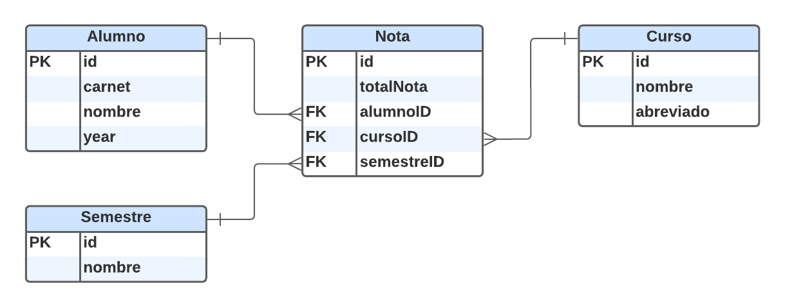

# Manual Tecnico

## Mockaroo

#### Generar carnet y nombre de alumnos

* Se genero 100 registros tipo json, solo con carnet y nombre:
    * carnet
        * type: **Regular Expression**
        * options: **^(\d{6})$**
    * nombre: 
        * type: **Fist Name**

* Se utilizo el siguiente codigo poder usarlos luego en un "Custom List":

```js
// Data donde estan los 100 objetos, dentro de un array
const data = require("./data1");

let carnets = "";
let nombres = "";

data.forEach(o => {
    carnets += o.carnet + ",";
    nombres += o.nombre + ",";
});

console.log(carnets);
console.log("");
console.log(nombres);

/* Salida, algo parecido a lo siguiente, pero con mas datos:

85188,958188,493569,085375,802001,828447

Andrew,Keriann,Iolanthe,Gordy,Janeva,Harlie

*/
```

#### Generar registros a utilizar en el trafico:

* carnet
    * type: **Custom List**
    * options: **Datos generados anteriormete**
    * **secuencial**
* nombre
    * type: **Custom List**
    * options: **Datos generados anteriormete**
    * **secuencial**
* curso
    * type: **Custom List**
    * options: **SO1,BD1,LFP,SA,AYD1**
    * **random**
* nota:
    * type: **Custom List**
    * options: **50,60,70,80,90,100**
    * **random**
* semestre
    * type: **Custom List**
    * options: **1S,2S**
    * **random**
* year
    * type: **Custom List**
    * options: **2023** 
    * **random**

## SQL

* Menu
* SQL
* Create Instance
* MySQL
* Instance ID: Nombre
* Password: Se puede generar 1
* Choose a Cloud SQL edition
	* Enterprise
* Choose a preset for this edition
	* Developtment o Sandbox
* Us-central1 (lowa)
* Connection
	* Public IP
	* New network
		* `all`
		* `0.0.0.0/0`
* Create instance
* Entrar a la db
* Panel izquierdo
* Overview
    * ip de la db
* Users
    * root por default, se puede cambiar el password tambien

## Entidad Relacion



[Ver scrips sql](../db/)

## Puertos apps

* Python: 5001
* gRPC-Client: 5002
* gRPC-Server: 50051
* Node: 5003
* React: 5173 - 80
* Python y Go para Ingress: 5016

## Variables de entorno

```
HOST_SERVER_PYTHON=
PORT_SERVER_PYTHON=

HOST_REDIS=
PORT_REDIS=

HOST_MYSQL=
NAMEDB_MYSQL=
USER_MYSQL=
PASS_MYSQL=
PORT_MYSQL=

HOST_GRPC_SERVER=
```

## k8s

#### Levantar Proyecto

```bash
#namespace
kubectl apply -f namespace/namespace.yaml

#secret
kubectl apply -f secret/secret.yaml

#redis
kubectl apply -f deployments/deploy-redis.yaml
kubectl apply -f services/service-redis.yaml

#python
kubectl apply -f deployments/deploy-backend-python.yaml
kubectl apply -f services/service-backend-python.yaml

#go
kubectl apply -f deployments/deploy-backend-go.yaml
kubectl apply -f services/service-backend-go.yaml

#node
kubectl apply -f deployments/deploy-backend-node.yaml
kubectl apply -f services/service-backend-node.yaml

#hpa
kubectl apply -f hpa/hpa.yaml

#Install
kubectl create ns nginx-ingress
helm repo add ingress-nginx https://kubernetes.github.io/ingress-nginx
helm repo update
helm install nginx-ingress ingress-nginx/ingress-nginx -n nginx-ingress
kubectl get services -n nginx-ingress

#Ingress
#Poner IP ingress controller (nginx), la IP Externa que nos da la de tipo load balancer
kubectl apply -f ingress/ingress.yaml
```

#### Ver objetos creados

```bash
kubectl get ns
kubectl get secret -n so1p2

kubectl get pods -n so1p2
kubectl get services -n so1p2

kubectl get pvc -n so1p2
kubectl get hpa -n so1p2
```

#### Acceder a CLI de redis

```bash
kubectl exec -it NAMEPOD redis-cli
KEYS *
GET keyregistro
HGETALL cantidad_notas
```

#### Obtener namespace
- `kubectl get ns`

#### Crear namespace
- `kubectl create ns <nombre_namespace>`

#### Crear cualquier objeto de k8s
- `kubectl apply -f <ruta_archivo> -n <nombre_namespace>`

#### Eliminar cualquier objeto de k8s
- `kubectl delete -f <ruta_archivo> -n <nombre_namespace>`

#### Editar cualquier objeto de k8s
- `kubectl edit <tipo_objeto> <nombre_objeto> -n <nombre_namespace>`

#### Obtener cualquier objeto de k8s
- `kubectl get <tipo_objeto> -n <nombre_namespace>`

#### Obtener todos los objeto de k8s (Exceptuando Ingress)
- `kubectl get all -n <nombre_namespace>`

#### Nodeport
- `kubectl port-forward service/<service-name> <local-port>:<service-port> -n <nombre_namespace>`

## CLUSTER

#### Crear cluster

* Menú
* Kubernetes engine API
* Habilitar
* Create
* Switch to standard
    * Nombre de cluster
* Grupo de nodo (default)
    * 4 nodos
    * 1-2cpu, 1 nucleo, 4RAM (cada nodo)
    * 30 GB
* Grupo de nodo (por redis)
    * 1 nodo
    * 4cpu, 2 nucleos, 4RAM
* Crear (258$/mes aprox.)

#### Acceder al cluster

* Abrir consola de GCP
* Open editor
* Ejecutar comando `pwd` para saber ruta de carpeta, tiene que ser algo como: `/home/g16_pweb`
* Clonar proyecto o copiar archivos en nuestro espacio de trabajo (carpeta anterior de preferencia).
* Entrar al cluster creado
* Connect
* Copiar URL y conectarnos desde consola del editor
* Damos autorización
* Ya podemos interactuar con el cluster con kubectl

## CLOUD RUN

#### Container Registry

* Ir a Menu
* Container Registry
* Habilitar
* Tener la imagen en docker hub
* Abrir consola de gcp
* Abrir editor
* Seleccionar carpeta de trabajo de nuestro usuario en el editor

```
docker pull gudiel/so1-py2-front:1.0.0
docker tag gudiel/so1-py2-front:1.0.0 gcr.io/<name-project>/so1-py2-front:v1
docker push gcr.io/<name-project>/so1-py2-front:v1
```

* Si no hace el push dar como permisos:

```
gcloud auth configure-docker
```

#### Cloud Run

* Ir a Menu
* Cloud Run
* Hablitar
* Crear servicio
* Implementar una revision desde una imagen de contenedor
* Seleccionar imagen creada
* Nombre de servicio
* Región
* Escala automatico
0-5 (si pones 0-5 puede que tarde un poquito en mostrar ya que levanta la instancia en el momento)
* Permitir todo el trafico
* Permitir invocaciones sin autenticar
* Contenedores, variables y secretos, conexiones, seguridad
    * Memoria y CPU
    * Poner puerto
    * variable de entorno
* Crear
