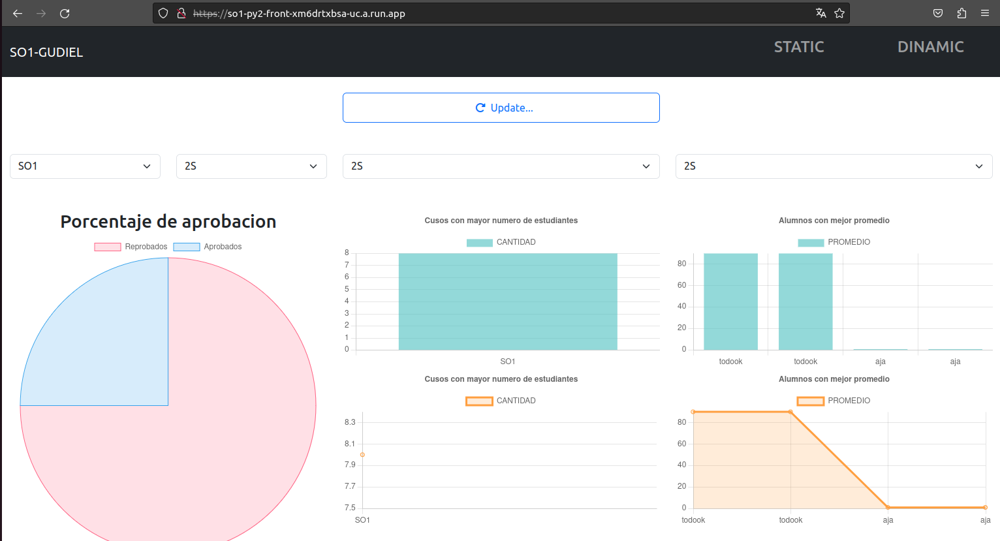
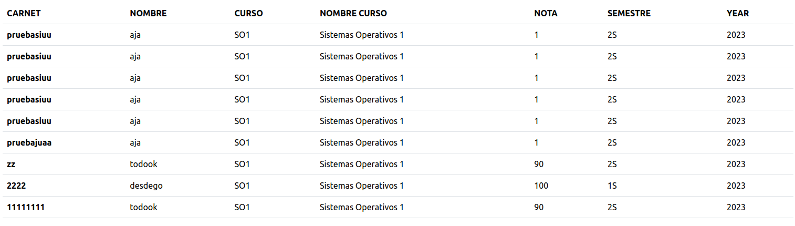
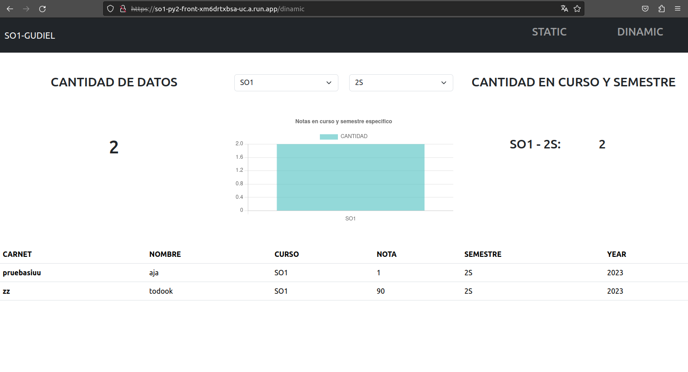

# Manual de usuario

## Link app

* https://so1-py2-front-xm6drtxbsa-uc.a.run.app

## Parte Estatica

* Navegacion
    * Static: Muestra la parte estatica de la app.
    * Dinamic: Muestra la parte dinamica de la app. 
* Boton refresh
    * Como su nombre indica refresca cada uno de los repotes segun los parametros seleccionados.
    * Refresca los datos de la tabla de datos almacenados.
    * En cada uno de los tres apartados, en la parte superior  de las graficas aparecen los parametros a seleccionar para visualizar reportes.

## Parte Dinamica

* Muestra el reporte de cantidad de notas en semestre especifico.
* Se pueden seleccionar los parametros para visualizarlos en el reporte.
* Muestra la cantidad de datos almacenados en la db.
* Muestra los datos almacenados en una tabla.

