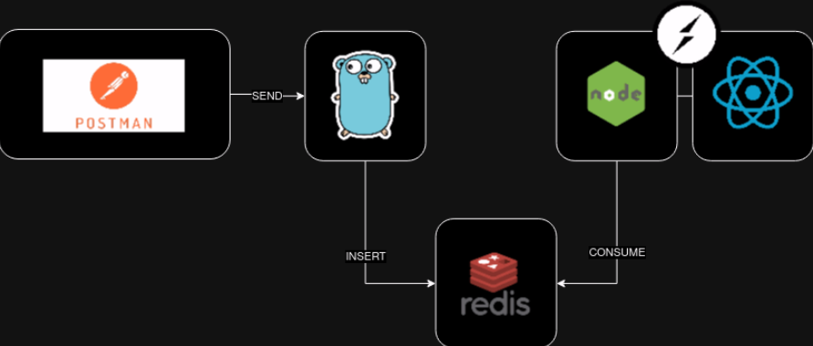

# Tarea 6

## Video

* https://youtu.be/_S-b3oQoC8Q

## Arquitectura



## Objeto JSON de envio desde Postman

```json
{
    "album": "Magical Mystery Tour",
    "artist": "The Beatles",
    "year": "1967"
}
```

## Comandos

### Redis

* Instalacion:

```bash
docker pull redis
docker run --name some-redis -d redis
docker run --name some-redis -p 6379:3379 -d redis
```

* Levantar contenedor:

```bash
docker start some-redis
```

### Redis commander

* Instalacion fisica:

```shell
https://joeferner.github.io/redis-commander/
npm install -g redis-commander
redis-commander
```

* Instalacion con docker:

```bash
docker pull redis
docker pull rediscommander/redis-commander
```

* Levantar contenedor:
    * http://localhost:8081

```bash
# ip (172.17.0.2) es del contenedor de redis (run)
docker run --rm --name redis-commander -d --env REDIS_HOSTS=local:172.17.0.2:6379 -p 8081:8081 rediscommander/redis-commander:latest
```

### Comandos Redis

```shell
# Entrar al container
docker exec -it id_container redis-cli

# Ver db's
CONFIG GET databases

# Seleccionar db
SELECT number

# Guardar valor
SET libro "texto aqui"

# Obtener valor
GET libro

# AGREGAR EN ARREGLO
# 1 = actualiza (ver docu)
ZADD "clave aqui" 1 "texto" 

# number1 = la puntuacion, por ej: ranking de 1 a 10
# number2 = cantidad a incrementar
HINCRBY "clave aqui - puede ser otra" number1 number2

# VER LO DEL ARREGLO
HGETALL "clave aqui"
# Retorna: 3 personas votaron 8, 1 persona voto 8.5
    # 1) "8"
    # 2) "3"
    # 3) "8.5"
    # 4) "1"
```